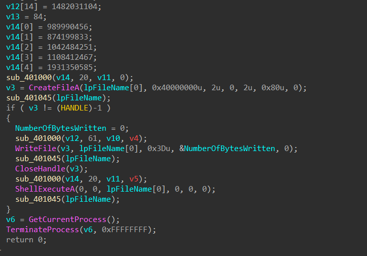

# garbage writeup

처음 UPX 언패킹을 시도하면 잘 되지 않습니다


파일 크기가 맞지 않으므로 뒤에 널바이트들을 추가해 크기를 늘려줍니다

이 상태로 언패킹을 한 뒤에 아이다로 열어보면 함수들이 깨져 있습니다


import 탭이 비어있어서 CFF Explorer의 Import Directory 탭에 들어가니 dll 이름이 없습니다


함수 이름을 보고 원래 dll 이름을 적어줍니다

그러면 이렇게 함수 이름이 보이게 됩니다



sub_401000함수는 문자열 간 xor 연산을 하고, sub_401045함수는 xor했던 걸 디코딩하는 함수이므로 sub_401000만 분석하면 될 것 같습니다

파이썬으로 구현해 실행하면 아래와 같습니다

```python
v10 = [110, 80, 84, 110, 97, 71, 76, 107, 73, 113, 100, 99, 81, 119, 118, 105, 101, 70, 81, 75, 71, 99, 84, 71, 79, 84, 98, 102, 77, 106, 68, 78, 109, 118, 105, 98, 102, 66, 68, 100, 70, 
66, 104, 111, 80, 97, 66, 98, 116, 102, 81, 117, 117, 71, 87, 89, 111, 109, 116, 113, 84, 70, 113, 118, 66, 83, 75, 100, 85, 77, 109, 99, 105, 113, 75, 83, 71, 90, 97, 111, 115, 87, 67, 83, 111, 90, 108, 99, 73, 108, 121, 81, 112, 79, 119, 107, 99, 65, 103, 119, 32]
v11 = [75, 103, 108, 80, 70, 79, 115, 81, 68, 120, 66, 80, 88, 109, 99, 108, 79, 112, 109, 115, 100, 76, 68, 69, 80, 77, 82, 87, 98, 77, 68, 122, 119, 104, 68, 71, 79, 121, 113, 65, 107, 
86, 77, 82, 118, 110, 66, 101, 73, 107, 112, 90, 73, 104, 70, 122, 110, 119, 86, 121, 108, 102, 106, 114, 107, 113, 112, 114, 66, 80, 65, 100, 80, 117, 97, 105, 86, 111, 86, 117, 103, 81, 65, 108, 121, 79, 81, 81, 116, 120, 66, 78, 115, 84, 100, 80, 90, 103, 68, 72, 32]
v12 = [35, 35, 51, 44, 14, 63, 100, 73, 10, 30, 10, 4, 35, 22, 2, 26, 68, 102, 8, 36, 50, 17, 116, 44, 42, 45, 66, 15, 62, 80, 100, 13, 93, 4, 27, 23, 22, 54, 3, 5, 52, 32, 9, 8, 99, 33, 
36, 14, 21, 20, 52, 88, 26, 41, 121, 58, 0, 0, 86, 88, 84]
v14 = [56, 14, 2, 59, 25, 59, 27, 52, 27, 12, 35, 62, 51, 8, 17, 66, 57, 18, 30, 115]

filename = str()
for i in range(20):
    filename += chr(v14[i] ^ v11[i])
print(filename)

command = str()
for i in range(61):
    command += chr(v12[i] ^ v10[i])
print(command)
```

`sink_the_tanker.vbs`
`MsgBox("Congrats! Your key is: C0rruptGarbag3@flare-on.com")`

아마 C0rruptGarbag3@flare-on.com가 플래그겠죠?