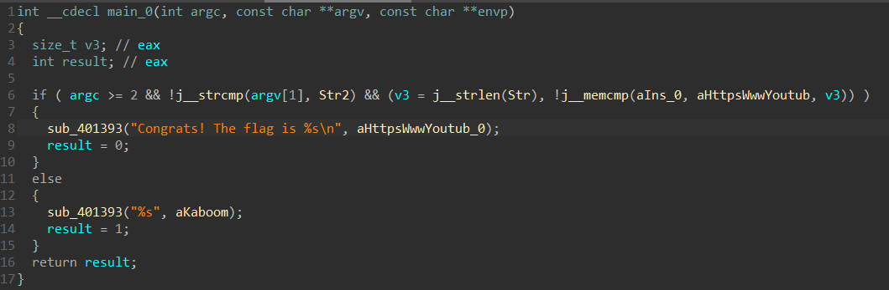
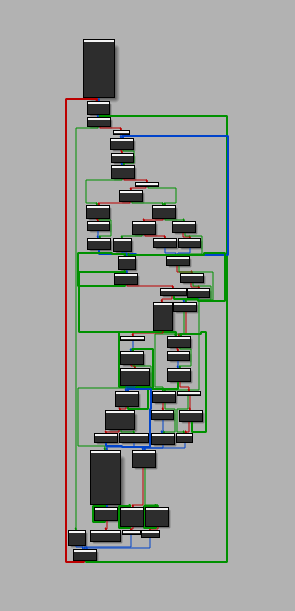
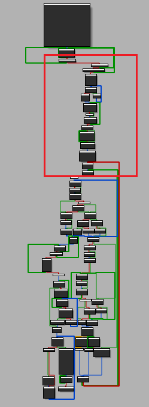
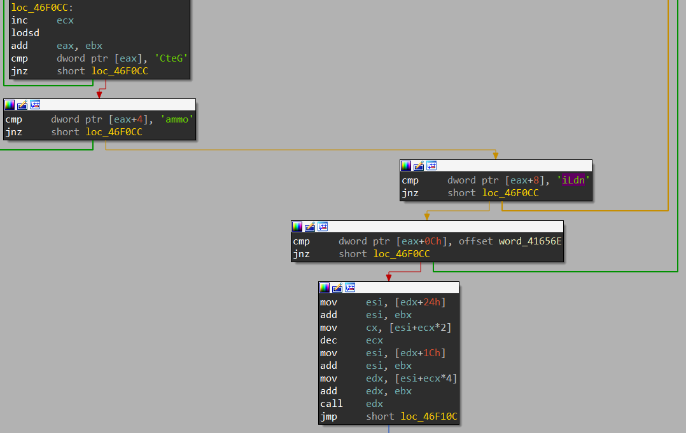
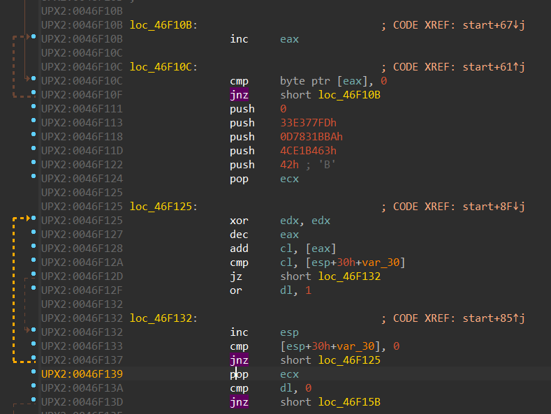
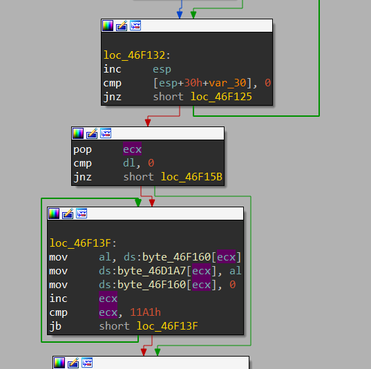

# kaboom writeup

바이너리를 보면 UPX 인코딩이 된 것처럼 보여 언패킹을 해보았습니다



인자에 defuse가 들어가면 youtube 링크가 나올 것으로 보이지만, fake flag입니다


언패킹한 바이너리를 다시 패킹한 것과 원본 바이너리를 비교하면 일부 차이점을 확인할 수 있습니다



오른쪽이 원본 바이너리인데, 결국 빨간 박스 부분이 중요하다는 것을 확인할 수 있습니다



먼저 GetCommandLineA 함수를 호출하는 부분이 있는 것을 보아 프로그램 실행 시의 인자를 사용한다는 것을 확인할 수 있습니다



실행 인자를 마지막 글자부터 스택에 push한 글자와 더하고 비교해서, 만약 다르면 edx에 1과 or 연산한 결과를 넣습니다



edx가 0일때만 어떤 연산을 하는데 아마 진짜 플래그를 만드는 부분이라 추측됩니다

따라서 위에서 edx가 1이 되지 않도록 역연산을 해야 합니다

```python
stack = [0x33, 0xe3, 0x77, 0xfd, 0xd7, 0x83, 0x1b, 0xba, 0x4c, 0xe1, 0xb4, 0x63, 0x42]
argv = str()
prev = stack.pop()
while stack:
    now = stack.pop()
    argv += chr((now - prev) % 0x100)
    prev = now

print(''.join(argv[::-1]))
```

`Plz&Thank-Q!`가 나오고, `kaboom.exe defuse Plz&Thank-Q!`로 실행하면 플래그가 나옵니다

`Congrats! The flag is INS{GG EZ clap PogU 5Head B) Kreygasm <3<3}`

다 구하고 나서 생각한 거지만 굳이 역연산을 안 해도 패치를 하던 동적 디버깅을 하던 해서 저걸 실행해도 플래그가 나옵니다

